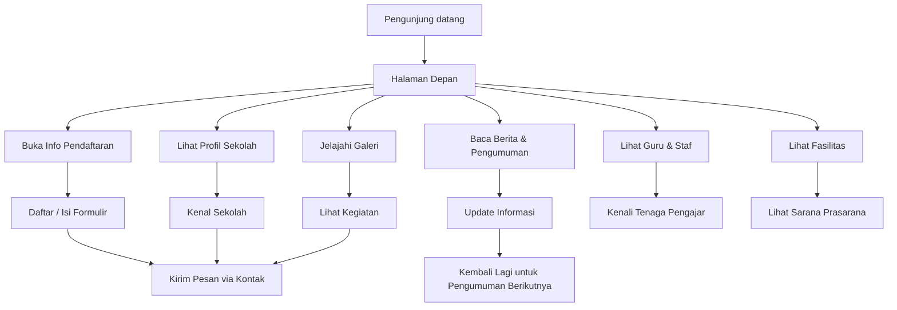
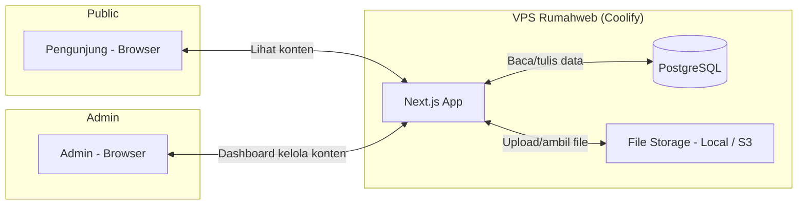
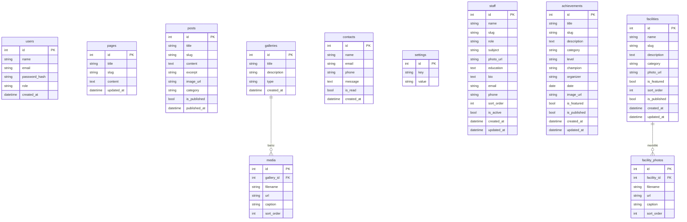

# PRD — Website Profil Sekolah

## 1. Overview

Website ini adalah **landing page resmi sekolah** yang berfungsi sebagai etalase digital untuk memperkenalkan sekolah kepada masyarakat umum. Masalah yang dihadapi: sekolah selama ini hanya mengandalkan brosur fisik dan media sosial yang kurang terstruktur dan terkesan tidak profesional. Tujuan utama website ini adalah **membangun citra profesional**, menyediakan seluruh informasi penting sekolah dalam satu tempat, dan menjadi sumber terpercaya bagi masyarakat yang ingin mengenal sekolah lebih dalam.

## 2. Requirements

- Website dapat diakses publik tanpa login
- Tampilan responsif — nyaman dibuka di HP, tablet, maupun laptop
- Desain profesional dan modern yang mencerminkan identitas sekolah
- Konten mudah diperbarui oleh admin sekolah (via dashboard sederhana)
- Kecepatan loading optimal karena target pengguna umum yang tidak sabar menunggu
- SEO-friendly agar mudah ditemukan di Google saat orang mencari nama sekolah
- Informasi yang ditampilkan selalu up-to-date, khususnya pengumuman dan berita

## 3. Core Features

- **Profil & Sejarah** — halaman lengkap tentang visi-misi, sejarah berdiri, sambutan kepala sekolah, struktur organisasi, dan data guru/staf
- **Berita & Pengumuman** — daftar artikel/kabar terbaru dari sekolah, termasuk pengumuman penting seperti libur, ujian, acara, dan prestasi
- **Halaman Kontak** — alamat lengkap, nomor telepon, email, formulir pesan, dan peta lokasi (Google Maps embed)
- **Info Pendaftaran** — syarat, alur, jadwal, biaya, dan link/formulir pendaftaran siswa baru (PPDB)
- **Galeri Foto & Video** — kumpulan dokumentasi kegiatan sekolah, fasilitas, dan video profil yang bisa dijelajahi pengunjung
- **Fasilitas Sekolah** — halaman khusus menampilkan sarana dan prasarana unggulan yang dimiliki, lengkap dengan foto, deskripsi, dan kategori
- **Highlight Prestasi** — tampilkan pencapaian siswa, guru, dan sekolah di halaman depan sebagai daya tarik; halaman lengkap daftar prestasi
- **Data Guru & Staf** — halaman publik yang menampilkan profil guru dan staf: foto, nama, jabatan, mata pelajaran, dan riwayat pendidikan

## 4. User Flow

1. Pengunjung mencari nama sekolah di Google atau mendapat link dari media sosial
2. Mendarat di **halaman depan (Home)** yang langsung menampilkan: foto utama, sambutan singkat, highlight prestasi, dan tautan cepat
3. Dari halaman depan, pengunjung bisa langsung **melihat profil sekolah** — informasi paling dicari (visi-misi, sejarah, siapa kepala sekolah)
4. Pengunjung menjelajahi bagian **Berita** untuk melihat kabar terbaru
5. Jika tertarik mendaftar, pengunjung masuk ke halaman **Info Pendaftaran** untuk membaca syarat, alur, dan mengisi formulir
6. Pengunjung ingin tahu lebih banyak: buka **Galeri** melihat foto/video kegiatan, atau kunjungi halaman **Fasilitas** dan **Guru & Staf**
7. Butuh tanya sesuatu: buka **Kontak**, lihat alamat di peta, atau kirim pesan via formulir
8. Beberapa minggu kemudian, pengunjung kembali karena ada **pengumuman penting** (misal: pembukaan PPDB, hasil seleksi, atau acara sekolah)



## 5. Architecture

Website dibangun dengan arsitektur **full-stack sederhana** — frontend yang langsung terhubung ke database PostgreSQL melalui backend API ringan. Admin punya halaman dashboard terpisah untuk mengelola konten.



## 6. Database Schema

Struktur data utama yang dibutuhkan (menggunakan PostgreSQL):

### 6.1 Tabel Dasar

| Tabel | Kolom Utama | Tipe | Keterangan |
|-------|-------------|------|------------|
| **users** | id, name, email, password_hash, role, created_at | SERIAL, VARCHAR, VARCHAR, VARCHAR, VARCHAR, TIMESTAMP | Akun admin; role = 'superadmin' atau 'admin' |
| **pages** | id, title, slug, content, updated_at | SERIAL, VARCHAR, VARCHAR, TEXT, TIMESTAMP | Halaman statis: profil, sejarah, visi-misi, kontak, info pendaftaran |
| **posts** | id, title, slug, content, excerpt, image_url, category, is_published, published_at | SERIAL, VARCHAR, VARCHAR, TEXT, TEXT, VARCHAR, VARCHAR, BOOLEAN, TIMESTAMP | Berita & pengumuman; category = 'news' / 'announcement' |
| **galleries** | id, title, description, type, created_at | SERIAL, VARCHAR, TEXT, VARCHAR, TIMESTAMP | Album galeri; type = 'photo' / 'video' |
| **media** | id, gallery_id, filename, url, caption, sort_order | SERIAL, INT, VARCHAR, VARCHAR, TEXT, INT | File foto/video di dalam album |
| **contacts** | id, name, email, phone, message, is_read, created_at | SERIAL, VARCHAR, VARCHAR, VARCHAR, TEXT, BOOLEAN, TIMESTAMP | Pesan masuk dari formulir kontak |
| **settings** | id, key, value | SERIAL, VARCHAR, TEXT | Konfigurasi: nama sekolah, logo, alamat, sosial media, dll |

### 6.2 Modul Guru & Staf

| Tabel | Kolom Utama | Tipe | Keterangan |
|-------|-------------|------|------------|
| **staff** | id, name, slug, role, subject, photo_url, education, bio, email, phone, sort_order, is_active, created_at, updated_at | SERIAL, VARCHAR, VARCHAR, VARCHAR, VARCHAR, TEXT, TEXT, TEXT, VARCHAR, VARCHAR, INT, BOOLEAN, TIMESTAMP, TIMESTAMP | Data guru & staf; role = 'headmaster' / 'teacher' / 'staff'; subject untuk guru mapel |

### 6.3 Modul Prestasi

| Tabel | Kolom Utama | Tipe | Keterangan |
|-------|-------------|------|------------|
| **achievements** | id, title, slug, description, category, level, champion, organizer, date, image_url, is_featured, is_published, created_at, updated_at | SERIAL, VARCHAR, VARCHAR, TEXT, VARCHAR, VARCHAR, VARCHAR, VARCHAR, DATE, TEXT, BOOLEAN, BOOLEAN, TIMESTAMP, TIMESTAMP | Data prestasi; category = 'student' / 'teacher' / 'school'; level = 'kecamatan' / 'kabupaten' / 'provinsi' / 'nasional' / 'internasional'; champion = '1' / '2' / '3' / 'harapan' / 'peserta'; is_featured = tampil di homepage |

### 6.4 Modul Fasilitas

| Tabel | Kolom Utama | Tipe | Keterangan |
|-------|-------------|------|------------|
| **facilities** | id, name, slug, description, category, photo_url, is_featured, sort_order, is_published, created_at, updated_at | SERIAL, VARCHAR, VARCHAR, TEXT, VARCHAR, TEXT, BOOLEAN, INT, BOOLEAN, TIMESTAMP, TIMESTAMP | Data fasilitas sekolah; category = 'akademik' / 'olahraga' / 'seni' / 'ibadah' / 'teknologi' / 'lainnya' |
| **facility_photos** | id, facility_id, filename, url, caption, sort_order | SERIAL, INT, VARCHAR, TEXT, TEXT, INT | Foto tambahan per fasilitas (bisa multi-foto) |

### 6.5 Entity Relationship Diagram



## 7. Tech Stack

| Komponen | Teknologi | Alasan |
|----------|-----------|--------|
| **Framework** | Next.js (App Router) | Cepat, SEO-friendly (SSR/SSG), satu framework untuk frontend + backend |
| **Styling** | Tailwind CSS + shadcn/ui | Desain profesional siap pakai, mudah dikustomisasi, mobile-first |
| **Database** | PostgreSQL dengan Drizzle ORM | Andal, performa tinggi, cocok untuk production, didukung penuh Coolify |
| **Autentikasi** | Better Auth | Aman, simpel, sudah mendukung session dan role-based access untuk dashboard admin |
| **File Storage** | Local filesystem (opsi upgrade ke S3/R2) | Simpan foto & video galeri; untuk awal simpan lokal, scale-up nanti jika perlu |
| **Deployment** | Coolify di VPS Rumahweb | Self-hosted PaaS — seperti Vercel tapi di server sendiri. Satu klik deploy Next.js + PostgreSQL, gratis tanpa biaya platform tambahan |

---

## 8. Dashboard Admin — Spesifikasi Lengkap

### 8.1 Struktur Menu Dashboard

Dashboard admin dapat diakses melalui path `/admin` setelah login. Struktur menu sidebar:

```
📊 Dashboard (halaman ringkasan)
├── 📝 Halaman
│   └── Daftar & edit halaman statis (Profil, Sejarah, Visi-Misi, Kontak, Pendaftaran)
├── 📰 Berita & Pengumuman
│   ├── Semua Postingan
│   ├── Tambah Baru
│   ├── Kategori: Berita
│   └── Kategori: Pengumuman
├── 👨‍🏫 Guru & Staf
│   └── Kelola data guru dan staf
├── 🏆 Prestasi
│   └── Kelola data prestasi
├── 🏫 Fasilitas
│   └── Kelola data fasilitas
├── 🖼️ Galeri
│   ├── Album Foto
│   └── Album Video
├── 📩 Pesan Masuk
│   └── Lihat & kelola pesan dari formulir kontak
└── ⚙️ Pengaturan
    ├── Identitas Sekolah (nama, logo, alamat, kontak)
    ├── Media Sosial (link Facebook, Instagram, YouTube, TikTok)
    └── Ubah Password
```

### 8.2 Fitur Tiap Menu

#### 8.2.1 Dashboard (Ringkasan)

Halaman utama setelah login, menampilkan:

- **Ringkasan angka**: jumlah total halaman, berita, guru/staf, prestasi, fasilitas, album galeri, dan pesan belum dibaca — ditampilkan dalam kartu-kartu kecil (4 kolom di desktop, 2 kolom di HP)
- **5 pesan terbaru** dari kotak masuk (preview: nama pengirim + cuplikan isi)
- **5 postingan terbaru** (judul + status published/draft)
- **Tombol cepat** (Quick Action): "Tambah Berita", "Tambah Prestasi", "Upload Foto", "Kelola Fasilitas"

#### 8.2.2 Halaman

- **Daftar halaman**: tabel dengan kolom Judul, Slug, Terakhir Diperbarui, Aksi (Edit)
- **Editor halaman**: rich text editor menggunakan **TipTap** untuk mengedit konten halaman statis. Toolbar standar: bold, italic, heading, list, link, gambar (upload inline)
- Slug tidak bisa diubah — sudah ditentukan sistem untuk halaman inti (profil, sejarah, visi-misi, kontak, pendaftaran)
- Admin tidak bisa menambah/menghapus halaman inti, hanya bisa mengedit konten
- Setelah simpan, halaman publik langsung ter-update (revalidate otomatis)

#### 8.2.3 Berita & Pengumuman

- **Daftar postingan**: tabel dengan kolom Judul, Kategori (badge warna: biru untuk Berita, oranye untuk Pengumuman), Status (Published/Draft), Tanggal, Aksi (Edit, Hapus). Ada pagination 10 item per halaman.
- **Form tambah/edit** (satu halaman penuh, bukan modal):
  - Judul (text input, wajib)
  - Slug (auto-generated dari judul, bisa diedit manual)
  - Kategori (dropdown: Berita / Pengumuman)
  - Excerpt/ringkasan (textarea, maks 200 karakter — tampil di card halaman depan)
  - Konten (rich text editor TipTap — bisa embed gambar, video YouTube, tabel)
  - Gambar unggulan (upload dengan preview, ukuran rekomendasi 1200×630px untuk OG image)
  - Status (toggle: Published / Draft)
  - Tanggal publikasi (date picker, default: hari ini)
- **Filter** berdasarkan kategori, status, dan rentang tanggal
- **Pencarian** berdasarkan judul postingan (search bar di atas tabel)
- **Hapus**: modal konfirmasi sebelum menghapus permanen

#### 8.2.4 Guru & Staf

*Dijelaskan detail di Bagian 9*

#### 8.2.5 Prestasi

*Dijelaskan detail di Bagian 10*

#### 8.2.6 Fasilitas

*Dijelaskan detail di Bagian 11*

#### 8.2.7 Galeri

- **Daftar album**: tabel dengan Judul, Tipe (badge: Foto/Video), Jumlah Media, Tanggal Dibuat, Aksi (Buka, Edit, Hapus)
- **Form tambah album** (modal): Judul, Deskripsi singkat, Tipe (Foto/Video)
- **Di dalam album** (halaman khusus):
  - **Album Foto**: grid thumbnail (3-4 kolom), setiap foto bisa diklik untuk preview besar
  - Upload foto: drag & drop area, mendukung multi-file (maks 10 file sekaligus, masing-masing maks 5 MB, format JPG/PNG/WebP)
  - **Album Video**: daftar video dengan thumbnail dari YouTube
  - Tambah video: input URL YouTube — sistem otomatis ambil thumbnail
  - Atur urutan: drag & drop thumbnail
  - Edit caption per media (inline)
  - Hapus media: tombol × di pojok thumbnail dengan konfirmasi

#### 8.2.8 Pesan Masuk

- **Daftar pesan**: tabel dengan Nama, Email, Telepon, Cuplikan Pesan (50 karakter pertama), Status (ikon amplop tertutup/terbuka), Tanggal
- **Detail pesan** (modal/halaman): tampilan lengkap semua field — nama, email, telepon, isi pesan
- Klik baris otomatis menandai pesan sebagai "Sudah Dibaca"
- Tombol "Tandai Semua Sudah Dibaca" di atas tabel
- Hapus pesan (individual, dengan konfirmasi)
- Badge jumlah pesan belum dibaca di sidebar menu

#### 8.2.9 Pengaturan

- **Identitas Sekolah**: form edit — Nama Sekolah, Tagline/Moto, Alamat lengkap, Nomor Telepon, Email resmi, Logo (upload, preview, rekomendasi PNG/SVG), Favicon (upload, 32×32px)
- **Media Sosial**: form edit — link Facebook, Instagram, YouTube, TikTok, Twitter/X (semua opsional)
- **Ubah Password**: form 3 field — password lama, password baru (minimal 8 karakter), konfirmasi password baru. Validasi: password lama benar, password baru & konfirmasi cocok.

### 8.3 Alur Pengelolaan Konten

**Alur umum untuk semua modul konten** (Berita, Prestasi, Guru, Fasilitas, Galeri):

```
Login → Dashboard → Pilih Menu → Daftar Data → [Tambah Baru | Edit | Hapus] → Simpan → Publik Terlihat
```

**Detail alur:**

1. Admin login di halaman `/admin/login` → masukkan email & password
2. Sistem verifikasi kredensial via Better Auth → redirect ke `/admin`
3. Admin memilih menu di sidebar → sistem menampilkan daftar data dengan tabel + pagination
4. Admin bisa melakukan:
   - **Tambah**: klik tombol "Tambah Baru" (warna kontras, posisi kanan atas) → isi form → klik "Simpan" → redirect ke halaman daftar + notifikasi toast hijau "Berhasil ditambahkan"
   - **Edit**: klik ikon ✏️ pada baris data → form terisi data existing → ubah → "Simpan Perubahan" → notifikasi toast
   - **Hapus**: klik ikon 🗑️ pada baris → modal konfirmasi muncul: "Yakin ingin menghapus [nama item]? Tindakan ini tidak bisa dibatalkan." → "Ya, Hapus" / "Batal"
5. Perubahan langsung tersimpan ke database PostgreSQL
6. Halaman publik di-revalidate otomatis menggunakan Next.js `revalidatePath()` setelah setiap operasi simpan/hapus

### 8.4 Hak Akses Admin

| Role | Hak Akses |
|------|-----------|
| **superadmin** | Akses penuh ke semua menu dashboard, termasuk Pengaturan dan Ubah Password. Bisa menambah/menonaktifkan akun admin lain. |
| **admin** | Akses ke semua menu konten (Halaman, Berita, Guru, Prestasi, Fasilitas, Galeri, Pesan Masuk). Hanya bisa **melihat** menu Pengaturan (tidak bisa edit). Tidak bisa mengelola akun admin lain. |

- Middleware Next.js memproteksi semua route `/admin/*` — redirect ke `/admin/login` jika tidak ada session
- Setiap halaman dashboard juga cek role sebelum render konten/aksi tertentu

### 8.5 Use Case Utama

| Use Case | Aktor | Alur Singkat |
|----------|-------|-------------|
| **Mengedit halaman "Profil Sekolah"** | Admin | Dashboard → Halaman → klik Edit pada "Profil" → ubah konten di TipTap editor → Simpan → publik langsung melihat perubahan |
| **Menambah berita baru** | Admin | Dashboard → Berita → Tambah Baru → isi judul, pilih kategori "Berita", tulis konten, upload gambar unggulan → klik Publish → muncul di halaman Berita publik |
| **Memposting pengumuman PPDB** | Admin | Dashboard → Berita → Tambah Baru → kategori "Pengumuman" → tulis syarat & jadwal PPDB → Publish → muncul di homepage + halaman Berita |
| **Menambah data guru baru** | Admin | Dashboard → Guru & Staf → Tambah → isi nama, pilih role "Guru", isi mapel, upload foto, isi pendidikan → Simpan → tampil di halaman Guru publik |
| **Menambah prestasi siswa** | Admin | Dashboard → Prestasi → Tambah → isi judul, kategori "Siswa", pilih level & juara, unggah foto → centang "Featured" → Publish → tampil di homepage highlight |
| **Mengelola fasilitas** | Admin | Dashboard → Fasilitas → Tambah → isi nama, pilih kategori, tulis deskripsi, upload foto cover → Simpan → tampil di halaman Fasilitas publik |
| **Upload foto kegiatan** | Admin | Dashboard → Galeri → buka album "Kegiatan" → drag & drop 10 foto → atur urutan → otomatis tersimpan → publik bisa lihat di halaman Galeri |
| **Membaca pesan masuk** | Admin | Dashboard → Pesan Masuk (badge "3") → klik pesan dari "Budi" → baca isi lengkap → otomatis tertandai sudah dibaca |
| **Mengubah logo sekolah** | Superadmin | Dashboard → Pengaturan → Identitas Sekolah → upload logo baru → Simpan → logo baru muncul di header website |

---

## 9. Modul Guru & Staf

### 9.1 Informasi yang Ditampilkan ke Publik

Halaman publik: `/guru-dan-staf`

**Tampilan halaman utama guru & staf:**

```
┌────────────────────────────────────────────┐
│  👨‍🏫 Guru & Staf Kami                       │
│                                            │
│  ┌──────┐  ┌──────┐  ┌──────┐  ┌──────┐  │
│  │ Foto │  │ Foto │  │ Foto │  │ Foto │  │
│  │Nama  │  │Nama  │  │Nama  │  │Nama  │  │
│  │Jbtan │  │Jbtan │  │Jbtan │  │Jbtan │  │
│  └──────┘  └──────┘  └──────┘  └──────┘  │
│                                            │
│  [Klik kartu → halaman detail]             │
└────────────────────────────────────────────┘
```

- **Kartu personil** menampilkan: foto profil, nama lengkap, jabatan (badge warna), dan mata pelajaran (jika guru)
- **Urutan tampil**: Kepala Sekolah di paling atas (selalu pertama), kemudian guru, lalu staf — masing-masing diurutkan berdasarkan `sort_order`
- Hanya staff dengan `is_active = true` yang ditampilkan
- Klik kartu membuka **halaman detail** (`/guru-dan-staf/[slug]`):

**Tampilan halaman detail per orang:**

```
┌────────────────────────────────────────────┐
│  [Foto Besar]    Nama Lengkap              │
│  200×200px       Jabatan                   │
│                  Mata Pelajaran            │
│                                            │
│  📚 Riwayat Pendidikan:                    │
│  S1 Pendidikan Matematika, UNJ (2010)      │
│  S2 Manajemen Pendidikan, UPI (2015)       │
│                                            │
│  📝 Biografi:                              │
│  Beliau telah mengabdi sebagai pendidik    │
│  selama lebih dari 10 tahun...             │
│                                            │
│  ✉️ Email: nama@sekolah.sch.id             │
└────────────────────────────────────────────┘
```

### 9.2 Database Schema

```sql
-- Tabel: staff (PostgreSQL)
CREATE TABLE staff (
    id          SERIAL PRIMARY KEY,
    name        VARCHAR(255) NOT NULL,
    slug        VARCHAR(255) NOT NULL UNIQUE,
    role        VARCHAR(50) NOT NULL DEFAULT 'teacher',  -- 'headmaster', 'teacher', 'staff'
    subject     VARCHAR(100),                 -- Mata pelajaran (hanya untuk guru)
    photo_url   TEXT,
    education   TEXT,                         -- Riwayat pendidikan (bisa multi-baris)
    bio         TEXT,                         -- Biografi singkat
    email       VARCHAR(255),
    phone       VARCHAR(50),                  -- Nomor telepon (internal, tidak ditampilkan publik)
    sort_order  INT DEFAULT 0,
    is_active   BOOLEAN DEFAULT TRUE,
    created_at  TIMESTAMP DEFAULT NOW(),
    updated_at  TIMESTAMP
);
```

### 9.3 Fitur CRUD pada Dashboard Admin

| Aksi | Fitur | Keterangan |
|------|-------|------------|
| **List** | Tabel dengan kolom: Foto (thumbnail 40×40px bulat), Nama, Jabatan (badge), Mapel, Status Aktif (toggle hijau/abu), Urutan, Aksi (Edit/Hapus) | Bisa drag & drop baris untuk mengatur ulang `sort_order`. Filter berdasarkan role. |
| **Create** | Form satu halaman: Nama (wajib), Jabatan (dropdown: Kepala Sekolah/Guru/Staf), Mata Pelajaran (muncul hanya jika jabatan "Guru"), Foto (upload + crop ke 1:1), Riwayat Pendidikan (textarea), Bio (textarea), Email, Nomor Telepon, Status Aktif (toggle) | Slug auto-generated dari nama. Validasi: Nama wajib, jika Guru maka Mapel wajib. |
| **Edit** | Form yang sama, terisi data existing | Ubah data → Simpan Perubahan → revalidate halaman publik |
| **Delete** | Modal konfirmasi: "Hapus [Nama] dari data guru & staf? Tindakan ini tidak bisa dibatalkan." | Hapus record + file foto dari storage |

### 9.4 Slug Auto-Generation

Slug dibuat otomatis dari nama, contoh:
- "Drs. Ahmad Fauzi, M.Pd." → `ahmad-fauzi`
- "Sri Wahyuni, S.Pd." → `sri-wahyuni`

Admin bisa mengedit slug manual jika terjadi konflik (nama sama).

---

## 10. Modul Prestasi

### 10.1 Jenis Prestasi

| Kategori | Keterangan | Contoh |
|----------|------------|--------|
| **student** | Prestasi yang diraih oleh siswa | Juara 1 Olimpiade Matematika, Medali Emas Pencak Silat |
| **teacher** | Prestasi yang diraih oleh guru secara individu | Guru Berprestasi Tingkat Provinsi, Inovasi Pembelajaran Terbaik |
| **school** | Prestasi yang diraih oleh sekolah sebagai institusi | Sekolah Adiwiyata Nasional, Akreditasi A, Sekolah Ramah Anak |

### 10.2 Tingkat Prestasi (Level)

| Level | Contoh |
|-------|--------|
| `kecamatan` | Juara di tingkat kecamatan/antar-sekolah setempat |
| `kabupaten` | Juara di tingkat kabupaten/kota |
| `provinsi` | Juara di tingkat provinsi |
| `nasional` | Juara di tingkat nasional |
| `internasional` | Juara di tingkat internasional |

### 10.3 Peringkat Kejuaraan (Champion)

| Nilai | Label Tampil | Ikon |
|-------|-------------|------|
| `1` | Juara 1 | 🥇 |
| `2` | Juara 2 | 🥈 |
| `3` | Juara 3 | 🥉 |
| `harapan` | Harapan | 🏅 |
| `peserta` | Peserta / Finalis | 🎖️ |

### 10.4 Database Schema

```sql
-- Tabel: achievements (PostgreSQL)
CREATE TABLE achievements (
    id          SERIAL PRIMARY KEY,
    title       VARCHAR(255) NOT NULL,
    slug        VARCHAR(255) NOT NULL UNIQUE,
    description TEXT,
    category    VARCHAR(50) NOT NULL DEFAULT 'student',  -- 'student', 'teacher', 'school'
    level       VARCHAR(50) NOT NULL DEFAULT 'kabupaten', -- 'kecamatan', 'kabupaten', 'provinsi', 'nasional', 'internasional'
    champion    VARCHAR(50) NOT NULL DEFAULT '1',         -- '1', '2', '3', 'harapan', 'peserta'
    organizer   VARCHAR(255),
    date        DATE,
    image_url   TEXT,
    is_featured BOOLEAN DEFAULT FALSE,
    is_published BOOLEAN DEFAULT TRUE,
    created_at  TIMESTAMP DEFAULT NOW(),
    updated_at  TIMESTAMP
);
```

### 10.5 Tampilan Highlight Prestasi di Homepage

Di halaman depan, tampil sebagai **section "Prestasi Membanggakan"**:

```
┌──────────────────────────────────────────────────────┐
│  🏆 Prestasi Membanggakan                             │
│                                                      │
│  ┌──────────┐  ┌──────────┐  ┌──────────┐          │
│  │ 🥇       │  │ 🥈       │  │ 🏅       │          │
│  │ Juara 1  │  │ Juara 2  │  │ Finalis  │          │
│  │ OSN MTK  │  │ Pencak   │  │ Guru     │          │
│  │ Nasional │  │ Provinsi │  │ Inovatif │          │
│  │          │  │          │  │ Nasional │          │
│  │ [Siswa]  │  │ [Siswa]  │  │ [Guru]   │          │
│  └──────────┘  └──────────┘  └──────────┘          │
│                                                      │
│  [Lihat Semua Prestasi →]                            │
└──────────────────────────────────────────────────────┘
```

- Hanya prestasi dengan `is_featured = true` dan `is_published = true` yang tampil
- Maksimal 3-6 item (tergantung lebar layar), diurutkan dari `level` tertinggi dan `date` terbaru
- Setiap kartu menampilkan: ikon juara besar, judul prestasi, tingkat (badge), kategori (badge: Siswa/Guru/Sekolah)

### 10.6 Halaman Daftar Prestasi Lengkap

Halaman publik: `/prestasi`

- **Filter horizontal di atas daftar**: Kategori (Semua/Siswa/Guru/Sekolah), Level (Semua/Kecamatan s.d. Internasional), Tahun
- **Tampilan daftar**: grid kartu (3 kolom desktop, 1 kolom HP), setiap kartu berisi:
  - Foto (jika ada) atau placeholder ikon juara
  - Badge kategori + level
  - Judul prestasi
  - Penyelenggara
  - Tanggal (format: "Januari 2025")
- Klik kartu → halaman detail prestasi (`/prestasi/[slug]`)
- **Halaman detail**: foto besar (jika ada), deskripsi lengkap, info: juara ke berapa, penyelenggara, tanggal, tingkat

### 10.7 Fitur CRUD pada Dashboard Admin

| Aksi | Fitur |
|------|-------|
| **List** | Tabel: Judul, Kategori (badge warna), Level (badge), Juara (ikon), Featured (ikon ⭐), Status, Tanggal, Aksi. Filter: kategori, level, tahun, status. Pagination 10/item. |
| **Create** | Form: Judul (wajib), Kategori (dropdown), Level (dropdown), Peringkat (dropdown dengan preview ikon), Penyelenggara, Tanggal (date picker), Deskripsi (textarea), Foto (upload), Featured (toggle), Published (toggle) |
| **Edit** | Form sama, terisi data existing. Slug auto-generated dari judul, bisa diedit manual. |
| **Delete** | Konfirmasi: "Hapus prestasi '[Judul]'? Tindakan ini tidak bisa dibatalkan." |

---

## 11. Modul Fasilitas

### 11.1 Kategori Fasilitas

| Kategori | Ikon | Contoh |
|----------|------|--------|
| `akademik` | 📚 | Ruang kelas, Perpustakaan, Laboratorium IPA, Laboratorium Komputer |
| `olahraga` | ⚽ | Lapangan basket, Lapangan futsal, Kolam renang, Aula serbaguna |
| `seni` | 🎨 | Ruang musik, Studio tari, Ruang lukis |
| `ibadah` | 🕌 | Masjid, Musholla, Ruang doa |
| `teknologi` | 💻 | Lab komputer, Smart classroom, Studio multimedia |
| `lainnya` | 🏫 | Kantin, UKS, Koperasi, Taman, Area parkir |

### 11.2 Database Schema

```sql
-- Tabel utama fasilitas (PostgreSQL)
CREATE TABLE facilities (
    id          SERIAL PRIMARY KEY,
    name        VARCHAR(255) NOT NULL,
    slug        VARCHAR(255) NOT NULL UNIQUE,
    description TEXT,
    category    VARCHAR(50) NOT NULL DEFAULT 'lainnya',
    photo_url   TEXT,                         -- Foto utama (cover)
    is_featured BOOLEAN DEFAULT FALSE,
    sort_order  INT DEFAULT 0,
    is_published BOOLEAN DEFAULT TRUE,
    created_at  TIMESTAMP DEFAULT NOW(),
    updated_at  TIMESTAMP
);

-- Foto tambahan per fasilitas (multi-foto)
CREATE TABLE facility_photos (
    id          SERIAL PRIMARY KEY,
    facility_id INT NOT NULL REFERENCES facilities(id) ON DELETE CASCADE,
    filename    VARCHAR(255) NOT NULL,
    url         TEXT NOT NULL,
    caption     TEXT,
    sort_order  INT DEFAULT 0
);
```

### 11.3 Halaman Fasilitas Publik

Halaman publik: `/fasilitas`

```
┌──────────────────────────────────────────────┐
│  🏫 Fasilitas Sekolah                         │
│                                              │
│  Filter: [Semua] [Akademik] [Olahraga]       │
│          [Seni] [Ibadah] [Teknologi] [Lain]  │
│                                              │
│  ┌──────────┐  ┌──────────┐  ┌──────────┐  │
│  │ Foto     │  │ Foto     │  │ Foto     │  │
│  │ Lab Kom  │  │ Lap.     │  │ Perpus   │  │
│  │          │  │ Basket   │  │          │  │
│  │[Teknologi]│ │[Olahraga]│  │[Akademik]│  │
│  └──────────┘  └──────────┘  └──────────┘  │
│                                              │
│  ┌──────────┐  ┌──────────┐  ┌──────────┐  │
│  │   ...    │  │   ...    │  │   ...    │  │
│  └──────────┘  └──────────┘  └──────────┘  │
└──────────────────────────────────────────────┘
```

- **Grid kartu** (3 kolom desktop, 2 tablet, 1 HP): foto cover, nama fasilitas, badge kategori
- **Filter tab/pill** di atas grid — klik kategori untuk memfilter, animasi transisi halus
- Klik kartu → halaman detail (`/fasilitas/[slug]`)

**Halaman detail fasilitas:**

```
┌──────────────────────────────────────────────┐
│  [Foto Cover Besar - full width]             │
│                                              │
│  [Badge Kategori]                            │
│  Nama Fasilitas                              │
│                                              │
│  Deskripsi lengkap...                        │
│                                              │
│  Galeri Foto:                                │
│  [Foto 1] [Foto 2] [Foto 3] [Foto 4]        │
│  (klik untuk lightbox)                       │
└──────────────────────────────────────────────┘
```

- Foto cover tampil full-width di atas
- Galeri foto tambahan di bawah deskripsi (grid 3-4 kolom)
- Klik foto membuka lightbox dengan navigasi next/previous
- Jika tidak ada foto tambahan, galeri tidak muncul

### 11.4 Fitur CRUD pada Dashboard Admin

| Aksi | Fitur |
|------|-------|
| **List** | Tabel: Foto (thumbnail 80×60px), Nama, Kategori (badge), Featured (⭐), Status, Urutan, Aksi. Drag & drop untuk sort order. Filter kategori. |
| **Create** | Form: Nama (wajib), Kategori (dropdown dengan ikon), Deskripsi (rich text / textarea), Foto Cover (upload, rekomendasi 1200×600px), Featured (toggle), Published (toggle) |
| **Edit** | Form sama + sub-section **"Galeri Foto"**: upload foto tambahan (drag & drop, multi-file), drag sort, edit caption per foto, hapus individual |
| **Delete** | Konfirmasi: "Hapus fasilitas '[Nama]'? Semua foto terkait juga akan dihapus." → cascade delete ke `facility_photos` + hapus file dari storage |

### 11.5 Highlight Fasilitas di Homepage (Opsional)

Jika ada fasilitas dengan `is_featured = true`, tampil section **"Fasilitas Unggulan"** di homepage:

- Maksimal 6 fasilitas
- Grid horizontal (scrollable di mobile)
- Setiap item: foto cover, nama fasilitas, badge kategori
- Di bawah grid: tombol "Lihat Semua Fasilitas →" mengarah ke `/fasilitas`

---

## 12. Rencana Implementasi (Roadmap Singkat)

| Fase | Fitur | Estimasi |
|------|-------|----------|
| **Fase 1** | Halaman publik: Home, Profil, Berita, Kontak, Pendaftaran. Dashboard admin: login, kelola halaman, berita, pesan masuk, pengaturan dasar. | 2 minggu |
| **Fase 2** | Galeri foto/video + Modul Guru & Staf + Modul Fasilitas (CRUD + halaman publik). | 1,5 minggu |
| **Fase 3** | Modul Prestasi + Highlight homepage (prestasi & fasilitas unggulan) + SEO optimization (meta tag, sitemap). | 1 minggu |
| **Fase 4** | Polish UI/UX, testing responsif (mobile/tablet/desktop), testing formulir, deployment ke Coolify di VPS Rumahweb, handover & pelatihan admin sekolah. | 1 minggu |

---

## 13. Catatan Tambahan

- **SEO**: Setiap halaman publik memiliki meta title, meta description, dan OG image otomatis (diambil dari gambar unggulan konten, atau logo sekolah sebagai fallback)
- **Sitemap.xml**: Auto-generated saat build (Next.js), mencakup semua halaman statis + detail page (berita, prestasi, fasilitas, guru/staf)
- **Keamanan Dashboard**: Middleware Next.js memproteksi semua route `/admin/*` — redirect ke login jika tidak ada session valid. CSRF protection dari Better Auth.
- **Upload file**: Maks ukuran 5 MB per file, format diterima: JPG, PNG, WebP, SVG. Video galeri menggunakan embed YouTube (tidak upload video langsung).
- **Notifikasi admin**: Badge jumlah di sidebar menu "Pesan Masuk" setiap ada pesan kontak baru.
- **Favicon & Logo**: Ukuran rekomendasi — Logo: PNG/SVG transparan, tinggi 60-80px. Favicon: 32×32px atau 48×48px PNG.
- **Rich Text Editor**: Gunakan TipTap (dengan ekstensi: StarterKit, Image, Link, Table, YouTube embed) untuk editor halaman dan konten berita.
- **Environment Variables**: Simpan kredensial penting di `.env` — `DATABASE_URL` (PostgreSQL), `BETTER_AUTH_SECRET`, `BETTER_AUTH_URL`. Coolify menyediakan UI untuk mengelola env vars dengan mudah.